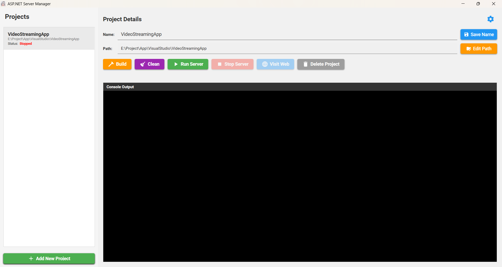
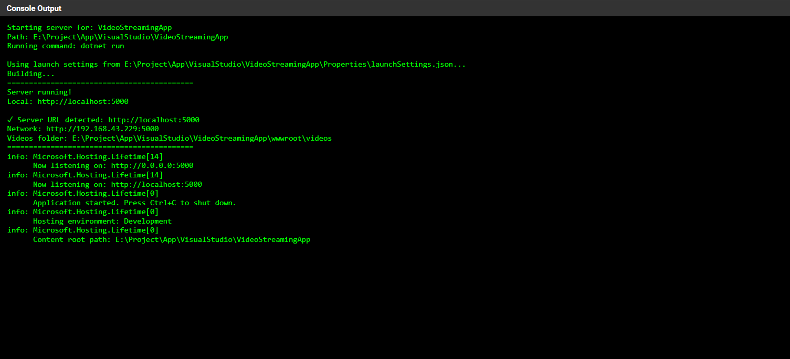
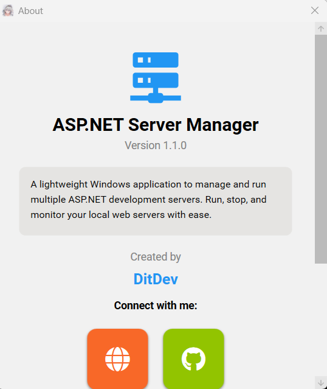

# ASP.NET Server Manager


A lightweight Windows desktop application to manage and run multiple ASP.NET development servers with ease. Built with WPF and Material Design.



## ✨ Features

### Core Features
- 🚀 **Quick Server Management** - Run, stop, and monitor multiple ASP.NET projects
- 🔨 **Build & Clean** - Build and clean projects directly from the app
- 🌐 **Auto Browser Launch** - Automatically detect server URL and open in browser
- 📊 **Live Console Output** - Real-time logs with terminal-style interface
- 💾 **Project Persistence** - Automatically saves your projects and settings
- 🔄 **Process Tracking** - Track running servers even after app restart

### Smart Features
- ✅ **Build State Tracking** - Prevents running unbuild projects
- 🎯 **PID Management** - Reconnect to servers left running in background
- 📝 **Editable Projects** - Rename projects and update paths anytime
- 🎨 **Material Design UI** - Modern, clean, and responsive interface
- 📱 **Responsive Layout** - Horizontal scrollbar for smaller screens

## 🖼️ Screenshots

### Main Interface
*Manage multiple projects with ease*


### Console Output
*Real-time server logs and build output*



### About Dialog
*Developer information and social links*



## 📋 Requirements

- **Operating System**: Windows 10/11
- **.NET Runtime**: .NET 8.0 or higher
- **.NET SDK**: For running ASP.NET projects (dotnet CLI)
- **Visual Studio**: Optional, for development

## 🚀 Installation

### Option 1: Download Release (Recommended)
1. Go to [Releases](https://github.com/rillToMe/ASP.NET-ServerManager/releases)
2. Download the latest `ServerManager-v1.1.0.zip`
3. Extract and run `ServerManager.exe`

### Option 2: Build from Source
```bash
# Clone the repository
git clone https://github.com/rillToMe/ASP.NET-ServerManager.git
cd ASP.NET-ServerManager

# Restore dependencies
dotnet restore

# Build the project
dotnet build

# Run the application
dotnet run
```

## 📖 Usage

### Adding a Project
1. Click **"+ Add New Project"** button
2. Select any file in your ASP.NET project folder
3. Project will be added to the list

### Building a Project
1. Select a project from the list
2. Click **"Build"** button
3. Wait for build completion in console output
4. ✅ indicates successful build

### Running a Server
1. Ensure project is built (Build button first if needed)
2. Click **"Run Server"** button
3. Server URL will be auto-detected
4. Click **"Visit Web"** to open in browser

### Cleaning a Project
1. Select a project from the list
2. Click **"Clean"** button
3. Build artifacts will be removed

### Managing Projects
- **Rename**: Edit name field and click "Save Name"
- **Change Path**: Click "Edit Path" and select new folder
- **Delete**: Click "Delete Project" to remove from list

## 🔧 Workflow

Standard development workflow:

```
Add Project → Build → Run → Stop → Clean → Build → Run
```

### Build States
- **Not Built** ⚠️ - Run button disabled
- **Built** ✅ - Run button enabled
- **Running** 🟢 - Stop button enabled

## 🎯 Keyboard Shortcuts

Currently no keyboard shortcuts implemented. Feature planned for v1.2.0.

## 🗂️ File Structure

```
ServerManager/
├── MainWindow.xaml          # Main UI layout
├── MainWindow.xaml.cs       # Main application logic
├── AboutWindow.xaml         # About dialog UI
├── AboutWindow.xaml.cs      # About dialog logic
├── App.xaml                 # Application resources
├── App.xaml.cs              # Application entry point
└── README.md                # This file
```

## 💾 Data Storage

Application data is stored in:
```
%AppData%/ServerManager/
├── projects.json            # Project list and settings
└── running_processes.json   # Active process PIDs
```

## 🔐 Privacy & Security

- All data stored locally
- No telemetry or analytics
- No network requests (except opening URLs in browser)
- Open source - audit the code yourself

## 🐛 Known Issues

- Console output may lag with high-frequency logs
- No support for non-dotnet projects yet

## 🤝 Contributing

Contributions are welcome! Please feel free to submit a Pull Request.

1. Fork the repository
2. Create your feature branch (`git checkout -b feature/AmazingFeature`)
3. Commit your changes (`git commit -m 'Add some AmazingFeature'`)
4. Push to the branch (`git push origin feature/AmazingFeature`)
5. Open a Pull Request

## 📄 License

This project is licensed under the MIT License - see the [LICENSE](LICENSE) file for details.

## 👨‍💻 Author

**DitDev**

- 🌐 Portfolio: [ditdev.vercel.app](https://ditdev.vercel.app/)
- 💻 GitHub: [@rillToMe](https://github.com/rillToMe)
- 📷 Instagram: [@rill_lyrics](https://www.instagram.com/rill_lyrics/)
- 🎵 TikTok: [@goodvibes_music28](https://www.tiktok.com/@goodvibes_music28)

## 🙏 Acknowledgments

- [MaterialDesignInXAML](https://github.com/MaterialDesignInXAML/MaterialDesignInXamlToolkit) - Beautiful Material Design components
- [FontAwesome.Sharp](https://github.com/awesome-inc/FontAwesome.Sharp) - Icon library
- ASP.NET Team - For the amazing framework

## 💬 Support

If you found this project helpful, please give it a ⭐️!

For bugs and feature requests, please [open an issue](https://github.com/rillToMe/ASP.NET-ServerManager/issues).

---

<p align="center">Made by DitDev</p>
<p align="center">© 2025 DitDev. All rights reserved.</p>
